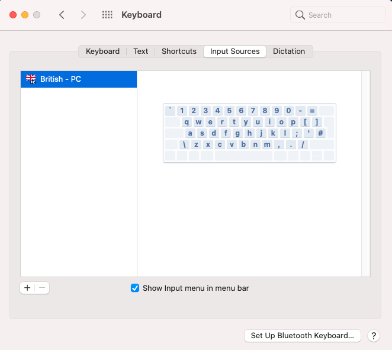
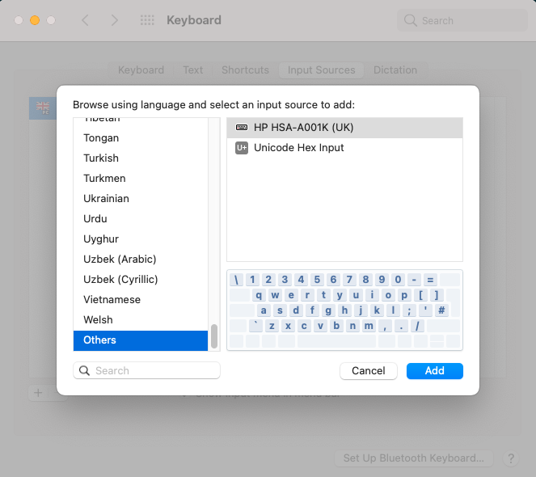
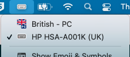

# macos-keyboard-layouts
Keyboard layout files for MacOS

## Available keyboard layouts
- HP keyboards available in the Turing offices (`HP-HSA-A001K.keylayout`)
- Dell keyboards available for home working (`Dell-KB216t.keylayout`)

## Installation instructions
Take the relevant `.keylayout` file and copy it to `/Library/Keyboard Layouts`.
If you don't have write permissions for this folder you can use `~/Library/Keyboard Layouts` instead, but this can cause your keyboard layout to reset whenever your screen locks!

Go to `System Preferences > Keyboard` and click on the `+` button at the bottom left

Click on `Others`, select the keyboard you have added and click `Add`

Ensure that this keyboard is selected as the one currently in-use

Note that you might have to reboot before this change is applied.
